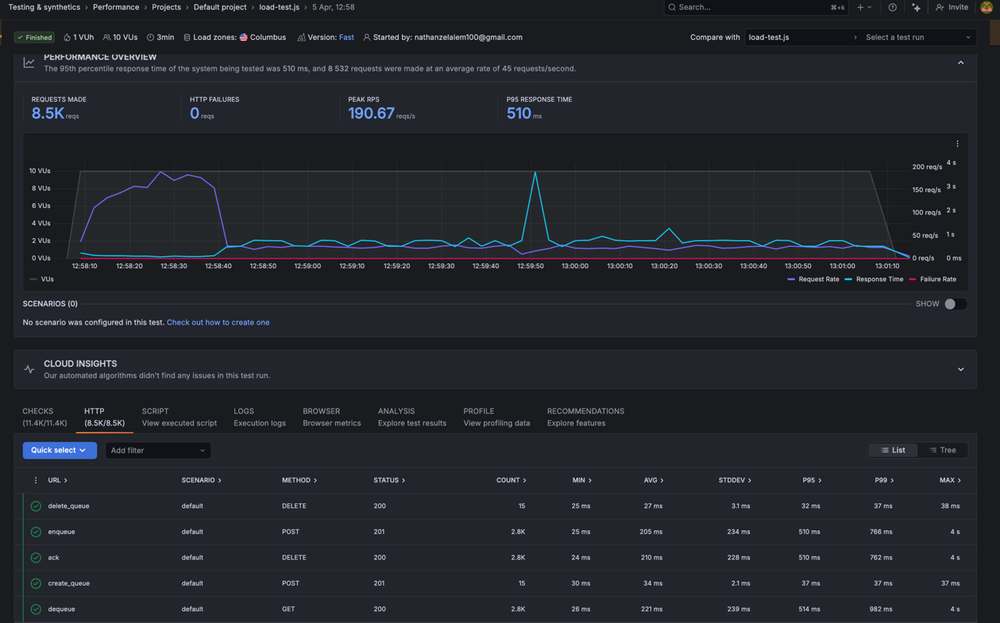
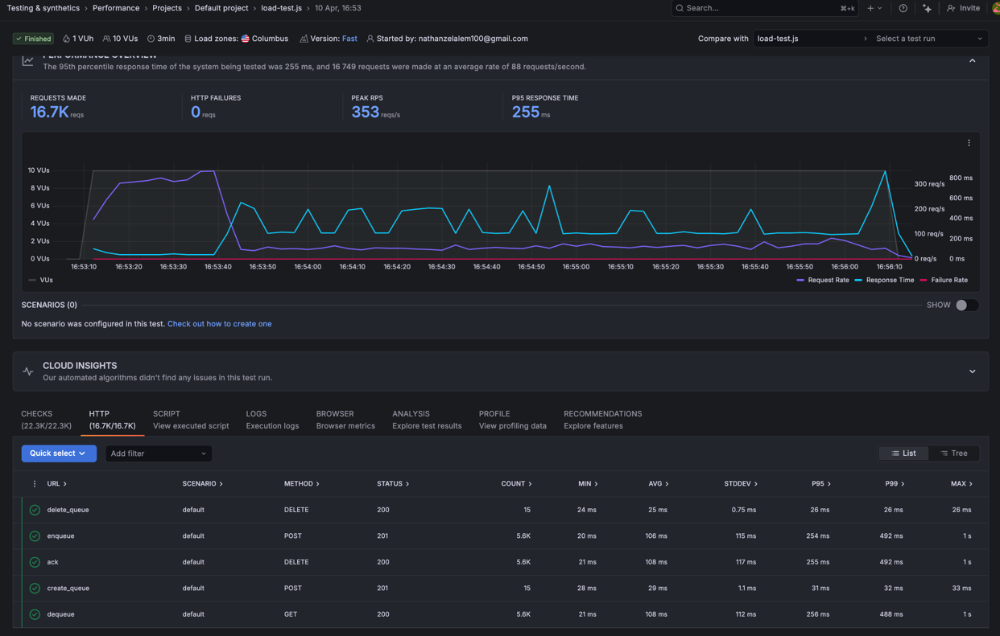
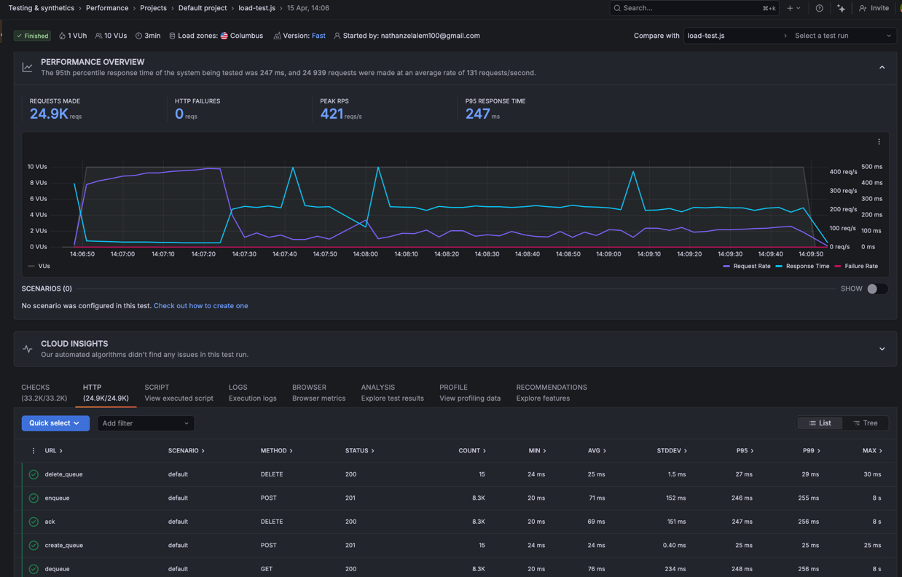

# Performance

Load testing is conducted via [Grafana Cloud Synthetic Monitoring](https://grafana.com/products/cloud/synthetic-monitoring/) using k6. All runs use a consistent setup: **10 VUs, 3 minutes, Columbus load zone**.

---

## Test Runs

### Run 1 — Baseline (Apr 5)

| Metric | Value |
|--------|-------|
| Total Requests | 8,500 |
| HTTP Failures | 0 |
| Peak RPS | 190 req/s |
| P95 Response Time | 510ms |
| P99 enqueue | 766ms |
| P99 dequeue | 982ms |

**Root cause:** GC stop-the-world pauses (up to 486ms, Eden space at 96%) compounded by thread pool stalling. An OOM incident confirmed the JVM was killed by the Linux OOM killer at ~413MB anon-rss.

**Remediation applied before Run 2:**
- 1GB swapfile added to the VM
- JVM heap pinned: `-Xms384m -Xmx384m -XX:MaxMetaspaceSize=128m`
- Docker Compose `mem_limit: 600m`

---

### Run 2 — Metrics Fix + Logging Level (Apr 10)

| Metric | Value |
|--------|-------|
| Total Requests | 16,700 |
| HTTP Failures | 0 |
| Peak RPS | 353 req/s |
| P95 Response Time | 255ms |
| P99 enqueue | 492ms |
| P99 dequeue | 488ms |

**Changes shipped:**

*Fix: Metrics memory leaks*
- Added `deregisterGaugesForQueue` to prevent phantom gauges on deleted queues
- Fixed `deleteQueue` to deregister gauges for both the queue and its DLQ
- Cached `Counter` instances to reduce per-operation allocation pressure

Deleted queues were leaving gauges behind that continued firing DB queries indefinitely. The `registeredGauges` map only ever grew — it never shrunk. Combined with creating new `Counter` objects on every operation, this was a sustained source of heap pressure.

*Fix: Logging level DEBUG → INFO*

Logging accounted for ~7% of total allocations — primarily short-lived objects increasing minor GC frequency. Switching to INFO/WARN reduced allocation pressure and GC cycle frequency.

**Result:** Throughput doubled (8.5K → 16.7K requests) and P95 halved (510ms → 255ms). The largest single improvement across all runs.

---

### Run 4 — HikariCP Tuning, Pool Size 8 (Apr 15)

| Metric | Value |
|--------|-------|
| Total Requests | 24,900 |
| HTTP Failures | 0 |
| Peak RPS | 421 req/s |
| P95 Response Time | 247ms |
| P99 enqueue | 255ms |
| P99 dequeue | 256ms |

**Root cause identified:** Under load, CPU saturation on the e2-micro (shared-core) caused a death spiral — TLS handshakes with PostgreSQL were taking 500ms+, and HikariCP's default dynamic pool scaling was attempting to create new connections exactly when the CPU was most throttled.

**Changes:**
- Fixed pool size: `minimum-idle` and `maximum-pool-size` both set to 8, eliminating on-demand connection creation during traffic spikes
- `max-lifetime` set to 3,600,000ms (1 hour) to prevent connection retirement overlapping with load test windows
- `connection-timeout` reduced to 2,000ms as a fail-fast mechanism against thread-pool bloat

**Result:** Throughput increased 49% (16.7K → 24.9K requests). The tight P95/P99 spread (247ms vs 255ms) confirms tail latency outliers from connection creation handshakes were eliminated.

---

### Run 4 — HikariCP Pool Downscaled to 6 (Apr 17)

| Metric | Value |
|--------|-------|
| Total Requests | 33,600 |
| HTTP Failures | 0 |
| Peak RPS | 426 req/s |
| P95 Response Time | 222ms |
| P99 enqueue | 245ms |
| P99 dequeue | 246ms |

**Rationale:** With 8 pool connections, each backed by a dedicated thread, the Linux scheduler on the single-core VM was paying increasing context-switching overhead. Reducing to 6 lets the CPU spend more time executing request logic and less time swapping between competing database workers.

**Changes:**
- `maximum-pool-size` and `minimum-idle` reduced from 8 to 6

**Result:** Another 35% throughput gain (24.9K → 33.6K requests). P95 improved to 222ms. P99 spread remains tight (245ms/246ms), confirming the connection pool is stable and well-sized for this hardware.

---

## Summary

| Run | Date | Change | Requests | Peak RPS | P95 |
|-----|------|--------|----------|----------|-----|
| 1 | Apr 5 | Baseline | 8,500 | 190 | 510ms |
| 2 | Apr 10 | Metrics fix + log level | 16,700 | 353 | 255ms |
| 3 | Apr 15 | HikariCP pool=8 | 24,900 | 421 | 247ms |
| 4 | Apr 17 | HikariCP pool=6 | 33,600 | 426 | 222ms |

From Run 1 to Run 4: **+296% throughput, -57% P95 latency**. Zero HTTP failures across all runs.
