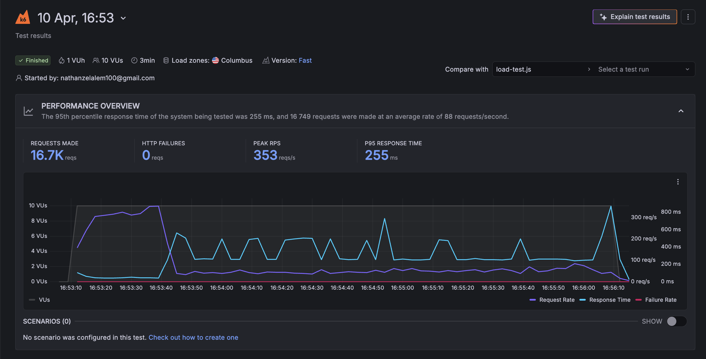
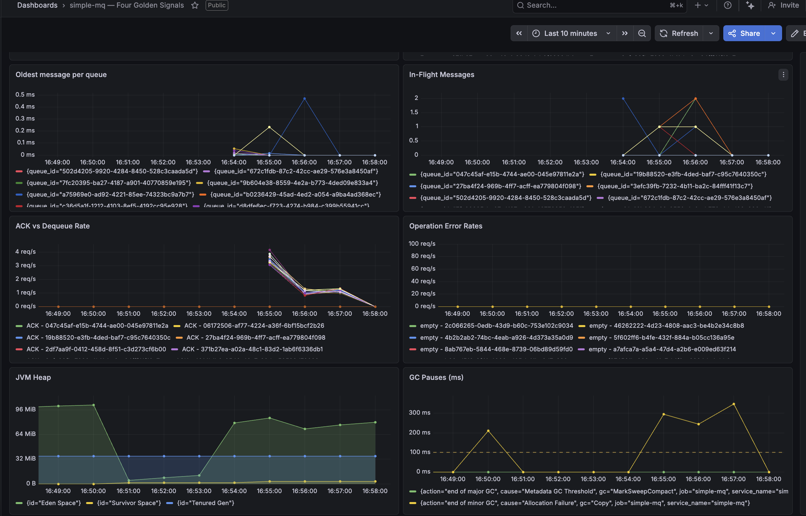
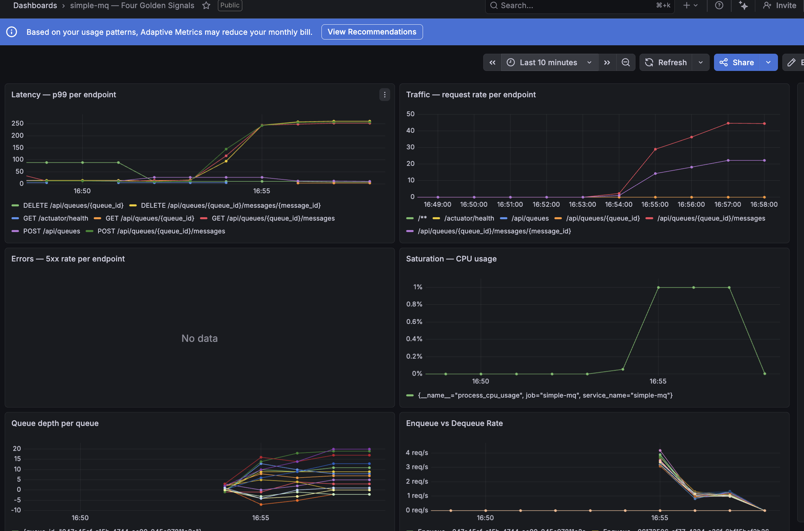

# simple-mq
[](https://github.com/nathanzk/simple-mq/actions)
[](https://sonarcloud.io/project/overview?id=NathanZK_simple-mq)
[](https://sonarcloud.io/summary/new_code?id=NathanZK_simple-mq)
[](https://sonarcloud.io/project/overview?id=NathanZK_simple-mq)
[](https://sonarcloud.io/project/overview?id=NathanZK_simple-mq)

A production-grade message queue service inspired by Amazon SQS. The application is intentionally simple — the focus is infrastructure, operations, and architecture decisions made explicitly.

---

## Table of Contents

- [Problem Statement](#problem-statement)
- [Requirements](#requirements)
- [API Design](#api-design)
- [High Level Design](#high-level-design)
- [Deep Dives](#deep-dives)
  - [Storage](#storage)
  - [Schema](#schema)
  - [Indexes](#indexes)
  - [Concurrent Consumers](#concurrent-consumers)
  - [Visibility Timeout](#visibility-timeout)
  - [DLQ Routing](#dlq-routing)
  - [Poll Flow](#poll-flow)
- [Observability](#observability)
- [Load Testing](#load-testing)
- [Known Limitations](#known-limitations)
- [Deployment](#deployment)

---

## Problem Statement

A producer generating work faster than a consumer can process it, or sending messages when a consumer is temporarily down, has nowhere to send its messages without a buffer in between. Without a queue, the producer must wait — blocking on the consumer's availability and speed. Slowness and failure propagate upstream.

This queue solves **temporal decoupling**: the producer and consumer do not need to be alive, healthy, or equally fast at the same time. The producer hands off a message to the queue and its responsibility ends. What happens after that — consumer speed, consumer failures, retries — is the queue's problem.

---

## Requirements

### Functional Requirements

- Producer pushes messages to a named queue
- Consumer polls messages from a named queue
- Consumer acknowledges a message after processing
- Acknowledged messages are deleted from the queue
- Unacknowledged messages become visible again after a configurable visibility timeout
- Failed messages (exceeding max delivery attempts) are routed to a Dead Letter Queue (DLQ)
- Messages in the DLQ can be requeued back to the original queue after debugging
- Multiple named queues are supported
- Multiple consumer servers can poll from the same queue (competing consumers)
- Queues can be deleted
- No message ordering guarantees

**Out of scope (v1):**
- Multiple consumer groups per queue
- Message ordering
- Exactly-once delivery

### Non-Functional Requirements

- **Durability**: Messages must survive server crashes. A message is considered safe once written to persistent storage.
- **At-least-once delivery**: The system guarantees a message will be delivered at least once. Duplicate delivery is possible; consumers must be idempotent.
- **Observability**: The system exposes the four golden signals — latency, traffic, errors, and saturation — with metrics specific to queue operations.
- **Automated deployment**: The system supports CI/CD with environment separation between staging and production.
- **Free tier constraint**: All infrastructure must operate within the free tier of the chosen cloud provider.

**Deferred non-functional requirements** (constrained by free tier, revisit after infrastructure audit):
- High availability with automatic failover
- Horizontal scalability targets
- Latency SLOs

#### Observability: Four Golden Signals

Each signal covers multiple metrics specific to queue operations:

**Latency**
- Time from producer push to durability acknowledgement
- Time from consumer poll request to message delivery

**Traffic**
- Messages enqueued per second
- Messages dequeued per second
- Acknowledgements per second
- DLQ transfer rate

**Errors**
- Failed enqueue rate
- Failed acknowledgement rate
- Messages routed to DLQ per second
- HTTP 5xx rate on queue endpoints

**Saturation**
- Queue depth per named queue
- Age of oldest unprocessed message
- In-flight message count (delivered but not yet acknowledged)

---

## API Design

### Create Queue

```
POST /api/queues
```

**Request**
```json
{
  "queue_name": "string",
  "queue_size": 1000,
  "visibility_timeout": 30,
  "max_deliveries": 3
}
```

| Field | Description |
|---|---|
| `queue_name` | Human-readable name for the queue |
| `queue_size` | Maximum number of messages the queue can hold |
| `visibility_timeout` | Seconds a message stays invisible after being polled |
| `max_deliveries` | Number of delivery attempts before routing to DLQ |

**Response**
```json
{
  "queue_id": "q_abc123"
}
```

The DLQ is created lazily — only when the first message is routed there. The DLQ ID is discoverable via the queue metadata endpoint.

**Status codes**
- `201` — queue created
- `400` — invalid request

---

### Get Queue Metadata

```
GET /api/queues/{queue_id}
```

**Response**
```json
{
  "queue_id": "q_abc123",
  "queue_name": "orders",
  "queue_size": 1000,
  "visibility_timeout": 30,
  "max_deliveries": 3,
  "current_message_count": 42,
  "dlq_id": "q_xyz789"
}
```

`dlq_id` is `null` if no messages have been routed to the DLQ yet.

**Status codes**
- `200` — success
- `404` — queue not found

---

### Delete Queue

```
DELETE /api/queues/{queue_id}
```

Deletes the queue and all messages it contains.

**Status codes**
- `200` — queue deleted
- `404` — queue not found

---

### Enqueue

```
POST /api/queues/{queue_id}/messages
```

**Request**
```json
{
  "data": "string"
}
```

Message data is an opaque string. The producer is responsible for serialization (e.g. JSON string). The consumer is responsible for deserialization. The queue does not interpret the payload.

**Response**
```json
{
  "message_id": "msg_def456"
}
```

**Status codes**
- `201` — message enqueued
- `429` — queue is full (back pressure); producer should back off and retry
- `404` — queue not found

---

### Poll

```
GET /api/queues/{queue_id}/messages
```

Returns the next available message and marks it invisible for the duration of `visibility_timeout`. If the message is not acknowledged within that window, it becomes visible again and can be picked up by another consumer.

**Response — message available**
```json
{
  "message_id": "msg_def456",
  "data": "string",
  "invisible_until": "2024-01-01T00:00:30Z"
}
```

**Response — queue empty**
```json
{
  "message": null
}
```

**Status codes**
- `200` — success (both empty and non-empty responses return 200)
- `404` — queue not found

An empty queue returns `200` with `message: null`, not `404`. The queue exists — it is simply empty. `404` is reserved for queues that do not exist.

---

### Acknowledge

```
DELETE /api/queues/{queue_id}/messages/{message_id}
```

Deletes the message from the queue. This is the consumer's signal that processing is complete.

**Response**
```json
{
  "message_id": "msg_def456",
  "deleted": true
}
```

**Status codes**
- `200` — message deleted
- `404` — message not found

`404` covers both fake message IDs and messages that have already been deleted (e.g. expired into the DLQ, or already acknowledged by another consumer). The queue does not retain deleted messages to provide a more specific error — that would require storing tombstones indefinitely.

---

### Requeue from DLQ

```
POST /api/queues/{dlq_id}/messages/{message_id}/requeue
```

Moves a message from the DLQ back to its parent queue. Resets `delivery_count` to 0 and sets `visible_at` to `NOW()` so it is immediately available for processing.

Used after debugging a failed message and fixing the underlying issue.

**Response**
```json
{
  "message_id": "msg_def456",
  "requeued_to": "q_abc123"
}
```

**Status codes**
- `200` — message requeued
- `404` — message not found

---

## High Level Design

```
Producer ──► Queue Service ──► PostgreSQL
Consumer ──► Queue Service ──►
```

### Current Deployment

The service runs as a single instance on a GCP e2-micro (`us-central1-a`) with no load balancer. Both the queue service and PostgreSQL run as Docker containers managed by Docker Compose on the same VM. Infrastructure is provisioned via Terraform with GCS remote state.

### Components

**Producer (external)**
The producer is outside the system boundary. It calls the enqueue API and considers its responsibility complete once it receives a `201`. It does not wait for consumer acknowledgement — that is the point of temporal decoupling.

**Consumer (external)**
The consumer is outside the system boundary. It polls the queue, processes messages, and acknowledges. Multiple consumer servers can poll the same queue simultaneously — the queue handles deduplication via row-level locking.

**Queue Service**
A monolith handling all API requests. Contains no background worker — DLQ routing and visibility timeout management happen at poll time (see Deep Dives). Built as a multi-arch Docker image (`amd64` and `arm64`).

**PostgreSQL**
Persists all messages and queue state. Runs in a separate container from the queue service so that a queue service crash does not take down storage.

### Design Decisions

**Decision: Monolith vs microservices**

Option 1: Monolith — API layer and all queue logic in a single process.

Option 2: Microservices — separate API service, DLQ routing service, visibility timeout service.

Decision: **Monolith.** Microservices introduce network latency and operational complexity between services that provides no benefit at this scale. A monolith is easier to deploy, debug, and reason about. Extract services when there is a concrete reason to, not before.

---

## Deep Dives

### Storage

**Decision: PostgreSQL vs MongoDB vs Cassandra**

Option 1: **PostgreSQL**
- Fits the query patterns exactly (filtering, ordering, multi-column conditions)
- Strong consistency out of the box
- `SELECT FOR UPDATE SKIP LOCKED` — built-in support for queue-like workloads (see Concurrent Consumers)
- Lightweight on free tier compute (lower memory footprint than MongoDB)
- Fully open source (MIT license)
- Fixed schema is a feature here — message structure is well defined and unlikely to change

Option 2: **MongoDB**
- Document store with rich querying and secondary indexes
- Fits the query patterns adequately
- Slightly heavier memory usage on constrained free tier instances
- SSPL license (relevant for some commercial contexts)
- Schema flexibility is not needed — message structure is fixed

Option 3: **Cassandra**
- Built for distributed writes and high write throughput
- Operationally heavy even for a single node
- The write/read ratio is roughly 1:1, not write-heavy — Cassandra's main strength does not apply
- Tunable consistency adds complexity without benefit at this scale

Decision: **PostgreSQL.** The query patterns are relational (range queries, multi-column filtering, ordered reads). `SKIP LOCKED` eliminates the need to implement optimistic concurrency manually. Lower memory footprint fits free tier constraints. MongoDB was a reasonable alternative but offered no advantage given the fixed schema.

Note: Managed database services (e.g. AWS RDS) were considered but rejected. Usage-based billing on managed services creates unpredictable costs — a single load test can generate an unexpected bill. Self-hosted PostgreSQL on a compute instance gives predictable resource usage within free tier limits.

---

### Schema

The schema has two tables: `queues` and `messages`.

A DLQ is structurally identical to a regular queue — it lives in the same `queues` table and uses the same endpoints. The only distinction is that a queue with messages routed to a DLQ has a `dlq_id` set, referencing the DLQ queue row. `dlq_id` is `null` for queues that have never had a message fail.

**Decision: Separate DLQ table vs single queues table**

A DLQ is a queue. Separating them into different tables would require coordinating inserts across two tables, duplicate query logic, and additional joins. With a proper index on `queue_id`, query performance is identical regardless of co-location. Single table wins.

**current_message_count consistency**

`current_message_count` is incremented on enqueue and decremented on acknowledgement. Both operations are wrapped in a transaction with the corresponding message insert or delete — either the message and the count update both succeed, or both fail. A failed transaction surfaces as an error to the caller, who retries. This is acceptable under at-least-once delivery semantics.

**delivery_count**

`delivery_count` starts at 0 when a message is enqueued and is incremented on every delivery including the first. `retry_count` was considered as the column name but rejected — incrementing on first delivery makes the name semantically incorrect. The DLQ routing condition is `delivery_count >= max_deliveries`.

**visible_at**

When a message is enqueued, `visible_at` is set to `NOW()`. The message is immediately eligible for polling. No separate "enqueued" state is needed.

---

### Indexes

```sql
CREATE INDEX idx_messages_poll
ON messages (queue_id, visible_at, delivery_count, created_at);
```

**Decision: Index strategy**

The poll query always filters on all four columns in the same order. A composite index matches the exact access pattern — `queue_id` eliminates most rows immediately, `visible_at` filters expired timeouts, `delivery_count` filters DLQ candidates, `created_at` satisfies the ORDER BY without a separate sort step. Poll latency stays flat regardless of queue depth.

Four separate indexes would require maintaining four index structures on every insert and delete with no query performance benefit for this access pattern. A single-column index on `queue_id` alone would degrade under deep queues.

Tradeoff: every insert and delete must update the composite index. For a balanced read/write ratio this is acceptable. If latency optimization becomes a priority, dropping to `(queue_id, visible_at)` and accepting in-memory filtering for the remaining columns is worth benchmarking with `EXPLAIN ANALYZE`.

---

### Concurrent Consumers

Multiple consumer servers can poll the same queue simultaneously. Without coordination, two servers could receive the same message.

The queue uses PostgreSQL's `SELECT FOR UPDATE SKIP LOCKED`. `FOR UPDATE` locks the selected row for the duration of the transaction. `SKIP LOCKED` means if a row is already locked by another transaction, skip it and move to the next eligible row — do not wait.

Without `SKIP LOCKED`, competing consumers would block on each other, serializing throughput. `SKIP LOCKED` allows multiple consumers to make progress simultaneously without coordination overhead.

This is one of the strongest arguments for PostgreSQL over document databases for this use case — MongoDB does not have an equivalent primitive. Implementing the same guarantee in MongoDB would require application-level optimistic concurrency.

Reference: [PostgreSQL documentation on SKIP LOCKED](https://www.postgresql.org/docs/current/sql-select.html#SQL-FOR-UPDATE-SHARE)

---

### Visibility Timeout

When a consumer polls a message, `visible_at` is set to `NOW() + visibility_timeout`. The message disappears from the queue for the duration of the timeout.

If the consumer acknowledges the message, it is deleted. If the consumer crashes, is slow, or fails to acknowledge — the message resurfaces automatically when `visible_at <= NOW()` becomes true again. No background worker is needed. No explicit reset is required. The next poll query picks it up.

When a message resurfaces, `delivery_count` is incremented on the next delivery. If `delivery_count >= max_deliveries`, it is routed to the DLQ at poll time.

---

### DLQ Routing

**Decision: Background worker vs routing at poll time**

Option 1: **Routing at poll time** — when a consumer polls, the queue first moves any eligible messages to the DLQ, then fetches the next valid message. No background worker. Two queries per poll request.

Option 2: **Background worker** — a dedicated process runs on a schedule and moves expired messages to the DLQ independently of polling activity.

The stale DLQ window exists in both approaches — messages only reach the DLQ when either a consumer polls or the background worker runs. The background worker adds resource cost and operational complexity with no meaningful improvement to the core problem. Polling-time routing wins. Revisit if the two-query overhead becomes a measurable latency concern.

**DLQ creation**

The DLQ is created lazily — only when the first message is routed there. Creating it eagerly on queue creation allocates resources for a failure path that may never be used.

`delivery_count` is intentionally not reset when routing to the DLQ. The count reflects how many delivery attempts were made before failure — useful for debugging.

---

### Poll Flow

The complete sequence for a single poll request, executed as one atomic transaction:

1. Move any messages where `delivery_count >= max_deliveries` and `visible_at <= NOW()` to the DLQ. If the DLQ does not exist yet, create it first.
2. Fetch the next valid message using `SELECT FOR UPDATE SKIP LOCKED`.
3. Increment `delivery_count` and set `visible_at = NOW() + visibility_timeout`.
4. Return `message_id`, `data`, and `invisible_until` to the consumer.

If step 2 returns no rows, return `{ "message": null }` with status `200`.

**DLQ full behavior**

If the DLQ has reached `queue_size`, messages that would be routed there remain in the main queue. Main queue depth grows, which triggers the saturation metric and alerts the operator. This is intentional — it forces the issue to be visible rather than silently dropping messages.

---

## Observability

Live dashboard: [Grafana Cloud — Four Golden Signals](https://nathanzk.grafana.net/public-dashboards/61234e232e854734bd240e7a5b0cb00b?from=now-3h&to=now&timezone=browser)

### Metrics

Custom Micrometer instrumentation pushes metrics to Grafana Cloud via OTLP every 60 seconds.

**Service-layer counters (per queue, per outcome)**
- `simplemq.enqueue.total` — enqueue attempts tagged by `outcome` (success, queue_full, queue_not_found)
- `simplemq.dequeue.total` — dequeue attempts tagged by `outcome`
- `simplemq.ack.total` — acknowledgement attempts tagged by `outcome`
- `simplemq.requeue.total` — requeue attempts tagged by `outcome`

**DB-backed gauges (per queue, sampled on push interval)**
- `simplemq.queue.depth` — current message count per queue
- `simplemq.queue.inflight` — messages currently invisible (delivered but not acknowledged)
- `simplemq.queue.oldest_message_age_seconds` — age of the oldest unprocessed message

### Synthetic Monitoring

Two k6 scripts run on Grafana Cloud at regular intervals:

- `happy-path.js` — runs every 5 minutes from two probe locations. Creates a queue, enqueues a message, dequeues it, ACKs it, and deletes the queue.
- `dlq.js` — runs every 15 minutes. Creates a queue with `maxDeliveries=1`, enqueues a message, lets the visibility timeout expire, verifies the message is routed to the DLQ, and cleans up.

Both scripts create and delete their queues within each run to prevent queue accumulation.

### Alerting

A Grafana alert fires when `probe_success{job="simple_mq_happy_path"}` drops below 1 for 5 consecutive minutes. Notifications are delivered via Telegram.

### Incident History

**April 2, 2026 — OOM kill**

The JVM had no heap limit configured. Under normal operation, OS + PostgreSQL + JVM exceeded the 1GB VM memory ceiling. The kernel OOM killer fired and killed the Java process. The outage went undetected for ~2 days due to no alerting being configured at the time.

Remediation: 1GB swapfile added, JVM flags set to `-Xms384m -Xmx384m -XX:MaxMetaspaceSize=128m`, Docker `mem_limit: 600m` added, Grafana alerting configured.

---

## Load Testing

A k6 load test was run against the production VM via Grafana Cloud k6 — 10 VUs, 3 minutes, 15 queues, Columbus load zone. Each VU looped enqueue → dequeue → ACK against a randomly selected queue for the full duration.

### Results

| Metric | Value |
|---|---|
| Total requests | 16,749 |
| HTTP failures | 0 |
| Peak RPS | 353 |
| Sustained RPS | ~88 |
| P95 latency | 255ms |



### Dashboard




### Findings

The service handled all requests without errors. Throughput nearly doubled compared to the initial run (190 → 353 peak RPS, P95 510ms → 255ms) following targeted optimizations:

- **Reduced allocation pressure** by caching Counter instances instead of creating new objects on every operation, and by raising log levels from DEBUG to INFO/WARN across application, Spring Web, and Hibernate SQL loggers — eliminating per-request string construction for every SQL statement and HTTP interaction under load
- **Fixed memory leaks in the metrics system** — deleted queues were leaving phantom gauges that continued issuing DB queries indefinitely, and the registeredGauges map grew unbounded. Added deregisterGaugesForQueue and wired it into deleteQueue for both queue and DLQ cleanup

**Bottleneck: GC stop-the-world pauses.** Eden space fills under sustained load from request/response object allocation, triggering stop-the-world pauses — 486ms in the initial run, 348ms in the latest. During these pauses, all request handlers freeze simultaneously, causing latency spikes across every endpoint. Effective concurrency collapses from 10 VUs to ~2 during this period.

**Recovery was clean.** Latency returned to baseline immediately after load tests ended — no OOM, no connection pool exhaustion, no runaway state.

**GC algorithm comparison.** Serial GC was evaluated as an alternative. It performed worse — P99 increased and peak RPS dropped from 190 to 173. Serial GC is designed for single-threaded batch workloads; under concurrent load the single-threaded collector takes longer to clear Eden than the default Parallel GC. Reverted.

### Context

The `-Xmx384m` heap ceiling was set deliberately to prevent OOM on a 1GB VM shared with PostgreSQL and the OS. This keeps the service stable under normal operation at the cost of throughput under sustained load. On production-grade hardware the same codebase would sustain significantly higher throughput with lower and more consistent latency.

---

## Known Limitations

- **Single PostgreSQL instance:** PostgreSQL is a single point of failure. If the database goes down, the queue is unavailable. A primary-replica setup with automatic failover is the path to high availability but requires additional compute beyond free tier.

- **Single VM, no load balancer:** The service runs as a single instance with no horizontal scaling. Adding instances requires a load balancer and a shared PostgreSQL instance.


- **No DLQ polling:** There is currently no way to poll messages directly from a DLQ. Messages can be requeued to the parent queue via the requeue endpoint, but direct DLQ consumption is not supported.

- **No ordering guarantees:** Messages are returned in approximate creation order but this is not guaranteed under concurrent load.

- **DLQ only updated on active polling:** If no consumers are polling, messages exceeding `max_deliveries` remain in the main queue until the next poll. This is a known tradeoff of routing at poll time vs a background worker.

- **No batching:** Poll returns one message per request. Batch polling (`?limit=N`) is a planned extension.

- **No queue limits per operator:** The number of queues an operator can create is currently unlimited.

---

## Deployment

### Infrastructure

- **Cloud:** GCP `us-central1-a`
- **VM:** e2-micro (0.25 vCPU, 1GB RAM)
- **Swap:** 1GB swapfile at `/swapfile`, persistent via `/etc/fstab`
- **Runtime:** Docker Compose
- **Provisioning:** Terraform with GCS remote state
- **Image:** `nathanzk/simple-mq:latest` (multi-arch: `amd64`, `arm64`)

### JVM Configuration

```
-Xms384m -Xmx384m -XX:MaxMetaspaceSize=128m
```

Heap is capped at 384MB to prevent OOM on the 1GB VM. Docker `mem_limit` is set to 600MB as a hard ceiling at the container level.

### CI/CD

GitHub Actions handles CI and CD:

- **CI:** Runs on pull requests to `main` — executes tests and code style checks
- **CD:** Runs on pushes to `main` — builds multi-arch Docker image and pushes to Docker Hub

Keyless GCP authentication via Workload Identity Federation — no long-lived credentials stored in GitHub secrets.

#### Required GitHub Secrets

- `DOCKERHUB_USERNAME` — Docker Hub username
- `DOCKERHUB_TOKEN` — Docker Hub access token

#### Manual Docker Build

```bash
# Build for production
docker build -t nathanzk/simple-mq:latest .

# Run the container
docker run -p 8080:8080 nathanzk/simple-mq:latest
```
